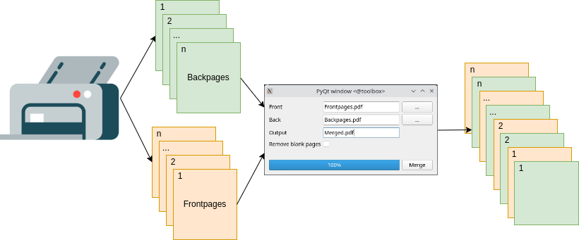

# Pdf-merger

A simplex scanner with a simple feed tray, produces two pdf files. Once the front pages in the order 1,2,...,n and once the back pages in reverse order n,...,2,1. This program takes the two PDFs as input and generates a PDF with the front and back pages in the correct order. Additionally there is the option to remove blank pages automatically.




# Run
To run the programm PyQt 5 and PyPDF needs to be installed.

```python3 src/pdf_merger.py```